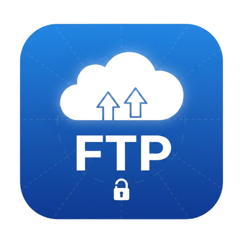

<div align="center">

# 🚀 FORTEftp



### Profesionální FTP/SSH Klient s Grafickým Rozhraním

[](https://www.python.org/downloads/)
[](LICENSE)
[](https://www.microsoft.com/windows)

Moderní a výkonný FTP/SSH klient postavený na PyQt5 s intuitivním dvoupanelovým rozhraním pro efektivní správu souborů a integrovaným SSH terminálem.

[Funkce](#-funkce) •
[Instalace](#-instalace) •
[Použití](#-použití) •
[Build](#-vytvoření-exe) •
[Dokumentace](#-dokumentace)

</div>

---

## ✨ Hlavní Funkce

### 🌐 Pokročilá Připojení
- **FTP** - Standardní FTP protokol
- **FTPS** - Zabezpečené FTP s SSL/TLS
- **SFTP** - SSH File Transfer Protocol
- Ukládání a správa více prostředí
- Rychlé přepínání mezi připojeními

### 📁 Inteligentní Správce Souborů
- **Dvoupanelové rozhraní** - Lokální ↔ Vzdálené soubory vedle sebe
- **Drag & Drop přenosy** - Jednoduché nahrávání/stahování
- **Synchronizace souborů** - 📤 Automatické nahrání pouze změněných souborů
- **Bezpečné mazání** - Volitelné mazání souborů, které nejsou v lokální složce
- **Správa složek** - Vytváření, mazání, procházení adresářů
- **Kontextové menu** - Rychlý přístup k operacím

### 💻 Integrovaný SSH Terminál
- Plnohodnotný SSH terminál přímo v aplikaci
- Barevné zvýraznění výstupu
- Historie příkazů
- Real-time výstup

### 🎯 Inteligentní Synchronizace
- Detekce změn podle data modifikace a velikosti
- Zobrazení přehledu změn před nahráním
- Progress bar s podrobným průběhem
- Reportování úspěchů a chyb

---

## 📋 Požadavky

- **Python** 3.8 nebo novější
- **Operační systém:** Windows 10/11
- **Závislosti:**
  - PyQt5 5.15.10
  - paramiko 3.4.0
  - cryptography 41.0.7

---

## 🔧 Instalace

### Metoda 1: Jednoduchá instalace (Windows)

```bash
# 1. Klonujte repozitář
git clone https://github.com/yourusername/forteftp.git
cd forteftp

# 2. Spusťte instalační skript
install.bat
```

### Metoda 2: Manuální instalace

```bash
# 1. Klonujte repozitář
git clone https://github.com/yourusername/forteftp.git
cd forteftp

# 2. Vytvořte virtuální prostředí (doporučeno)
python -m venv .venv
.venv\Scripts\activate

# 3. Nainstalujte závislosti
pip install -r requirements.txt

# 4. Spusťte aplikaci
python FORTEftp.py
```

### Metoda 3: Rychlé spuštění

```bash
run.bat
```

---

## 📦 Vytvoření .exe

Vytvořte standalone aplikaci bez potřeby Pythonu:

```bash
# 1. Nainstalujte PyInstaller
pip install pyinstaller

# 2. Spusťte build script
python build_exe.py
```

**Výsledný soubor:** `dist/FORTEftp.exe` (přenositelný, žádná instalace)

---

## 🚀 Použití

### 1️⃣ Vytvoření Připojení

<details>
<summary>Klikněte pro rozbalení</summary>

1. Spusťte FORTEftp
2. Klikněte **"➕ Nové"**
3. Vyplňte údaje:
   ```
   Název prostředí: Můj FTP Server
   Typ: FTP / FTPS / SFTP (SSH)
   Server: ftp.example.com
   Port: 21 (FTP), 990 (FTPS), 22 (SFTP)
   Uživatel: username
   Heslo: ••••••••
   Výchozí složka: /public_html
   ```
4. Klikněte **"Uložit"**

</details>

### 2️⃣ Připojení k Serveru

1. Vyberte prostředí z rozbalovacího menu
2. Klikněte **"🔌 Připojit"**
3. ✅ Stavový řádek zobrazí "Připojeno"

### 3️⃣ Operace se Soubory

| Operace | Postup |
|---------|--------|
| **Nahrát soubor** | Vyberte soubor vlevo → **⬆️ Nahrát na server** |
| **Stáhnout soubor** | Vyberte soubor vpravo → **⬇️ Stáhnout ze serveru** |
| **Nahrát změny** | **📤 Nahrát změny** → Vyberte volby → Potvrďte |
| **Nová složka** | Pravý klik → **🆕 Nová složka** → Zadejte název |
| **Smazat** | Pravý klik → **🗑️ Smazat** → Potvrďte |
| **Obnovit** | Pravý klik → **🔄 Obnovit** |

### 4️⃣ Inteligentní Synchronizace

```
1. Otevřete lokální složku s projektem
2. Připojte se k FTP/SFTP serveru
3. Klikněte "📤 Nahrát změny"
4. ☑️ Zaškrtněte "Smazat soubory, které nejsou lokálně" (volitelné)
5. Potvrďte synchronizaci
```

**Aplikace automaticky:**
- ✅ Najde nové soubory
- ✅ Detekuje změněné soubory (podle času a velikosti)
- ✅ Zobrazí přehled změn
- ✅ Nahraje pouze potřebné soubory
- 🗑️ Smaže vzdálené soubory (pokud je aktivní volba)

### 5️⃣ SSH Terminál

1. Připojte se k SFTP (SSH) prostředí
2. Přepněte na záložku **"💻 SSH Terminál"**
3. Zadávejte příkazy jako v běžném terminálu

---

## 🗂️ Struktura Projektu

```
forteftp/
├── 📄 FORTEftp.py              # Hlavní aplikace
├── 📄 requirements.txt          # Python závislosti
├── 📄 build_exe.py              # Build script pro .exe
├── 🖼️ icon.ico                  # Ikona aplikace
├── 🖼️ icon.png                  # PNG ikona
├── 📄 forte_environments.json   # Uložená prostředí (auto-generováno)
├── 📜 install.bat               # Instalační skript (Windows)
├── 📜 run.bat                   # Spouštěcí skript (Windows)
└── 📖 README.md                 # Tento soubor
```

---

## ⚙️ Konfigurace

### Soubor prostředí
Všechna připojení jsou uložena v:
```
forte_environments.json
```

**Formát:**
```json
[
  {
    "name": "Produkční Server",
    "type": "SFTP (SSH)",
    "host": "example.com",
    "port": 22,
    "user": "username",
    "password": "password",
    "remote_path": "/home/user/public_html"
  }
]
```

---

## 🔒 Bezpečnost

| ⚠️ Důležité bezpečnostní upozornění |
|--------------------------------------|
| Hesla jsou uložena v **plain textu** v `forte_environments.json`. Tento soubor chraňte! |

**Doporučení:**
- ✅ Používejte silná, unikátní hesla
- ✅ Chraňte `forte_environments.json` před neoprávněným přístupem
- ✅ Pravidelně aktualizujte přístupové údaje
- ✅ Nekopírujte tento soubor na veřejná úložiště
- ✅ Používejte FTPS/SFTP místo běžného FTP

---

## 🐛 Řešení Problémů

<details>
<summary><b>❌ Nelze se připojit k FTP serveru</b></summary>

- Zkontrolujte firewall a antivirový software
- Ověřte správnost přihlašovacích údajů
- Zkuste pasivní/aktivní režim
- Ověřte, zda server běží a je dostupný
- Zkontrolujte port (21 pro FTP, 990 pro FTPS)

</details>

<details>
<summary><b>💻 SSH terminál nereaguje</b></summary>

- Počkejte na dokončení předchozího příkazu
- Zkontrolujte síťové připojení
- Restartujte připojení (Odpojit → Připojit)
- Ověřte SSH klíče a autorizaci

</details>

<details>
<summary><b>📁 Chyba při přenosu souborů</b></summary>

- Zkontrolujte oprávnění na serveru
- Ověřte dostupné místo na disku
- Zkontrolujte síťové připojení
- Ověřte cestu ke složce

</details>

<details>
<summary><b>🔧 Aplikace se nespustí</b></summary>

```bash
# Zkontrolujte Python verzi
python --version  # Mělo by být 3.8+

# Přeinstalujte závislosti
pip install -r requirements.txt --force-reinstall

# Spusťte s ladícími informacemi
python FORTEftp.py --verbose
```

</details>

---

## 🛠️ Technologie

- **Frontend:** PyQt5 (GUI Framework)
- **FTP/FTPS:** Python ftplib
- **SSH/SFTP:** Paramiko
- **Kryptografie:** cryptography
- **Build:** PyInstaller

---

## 📝 Changelog

### v1.0.0 (Únor 2026)
- ✨ První veřejné vydání
- 🌐 Podpora FTP, FTPS, SFTP
- 📁 Dvoupanelový správce souborů
- 💻 Integrovaný SSH terminál
- 📤 Inteligentní synchronizace změn
- 🗑️ Bezpečné mazání vzdálených souborů
- 🎨 Moderní GUI s ikonou
- 📦 Build do .exe

---

## 📄 Licence

Copyright © 2026 FORTE

Permission is hereby granted, free of charge, to any person obtaining a copy of this software and associated documentation files (the "Software"), to deal in the Software without restriction, including without limitation the rights to use, copy, modify, merge, publish, distribute, sublicense, and/or sell copies of the Software, and to permit persons to whom the Software is furnished to do so, subject to the following conditions:

The above copyright notice and this permission notice shall be included in all copies or substantial portions of the Software.

THE SOFTWARE IS PROVIDED "AS IS", WITHOUT WARRANTY OF ANY KIND, EXPRESS OR IMPLIED, INCLUDING BUT NOT LIMITED TO THE WARRANTIES OF MERCHANTABILITY, FITNESS FOR A PARTICULAR PURPOSE AND NONINFRINGEMENT. IN NO EVENT SHALL THE AUTHORS OR COPYRIGHT HOLDERS BE LIABLE FOR ANY CLAIM, DAMAGES OR OTHER LIABILITY, WHETHER IN AN ACTION OF CONTRACT, TORT OR OTHERWISE, ARISING FROM, OUT OF OR IN CONNECTION WITH THE SOFTWARE OR THE USE OR OTHER DEALINGS IN THE SOFTWARE.

---

## 🤝 Přispívání

Přispění jsou vítána! Prosím:

1. Forkněte repozitář
2. Vytvořte feature branch (`git checkout -b feature/AmazingFeature`)
3. Commitněte změny (`git commit -m 'Add some AmazingFeature'`)
4. Pushněte do branch (`git push origin feature/AmazingFeature`)
5. Otevřete Pull Request

---

## 👤 Autor

**FORTE**

- GitHub: [@yourusername](https://github.com/yourusername)
- Email: your.email@example.com

---

## 🙏 Poděkování

- PyQt5 team za výborný GUI framework
- Paramiko projekt za SSH implementaci
- Všem přispěvatelům open-source knihoven

---

<div align="center">

**[⬆ Zpět nahoru](#-forteftp)**

Made with ❤️ by FORTE

</div>
